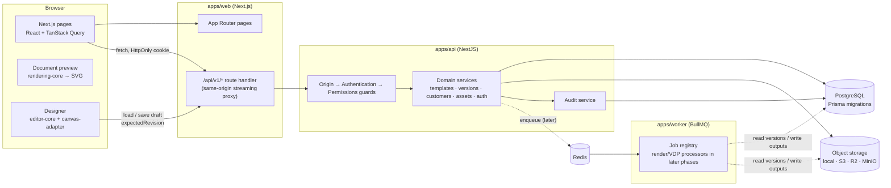
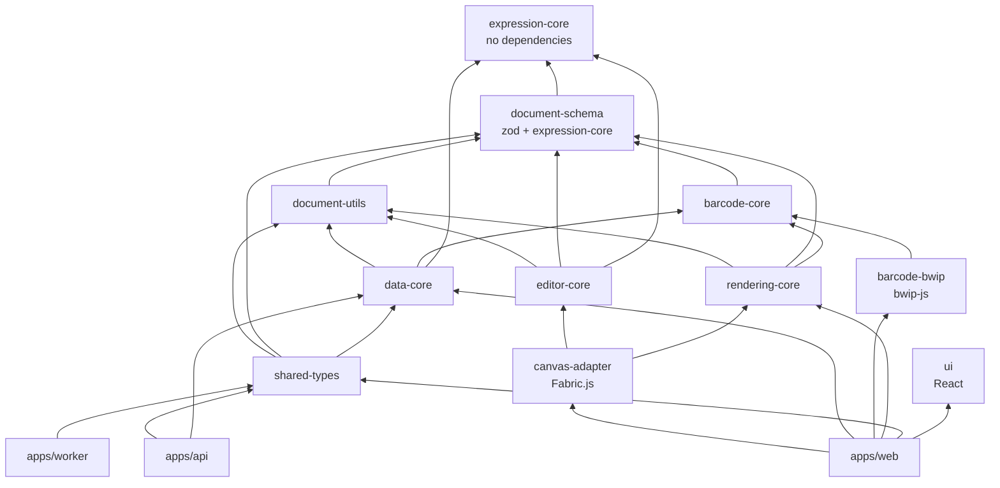

# Architecture

SmartTag Platform is a document-centric system for designing, versioning and (later) producing
labels and hang tags. Its core is built around

**Document + Artwork Objects + Data + Rules + Rendering + Workflow**

rather than a single-purpose "hang tag generator". Hang tags are the first enabled document type;
care labels, price tickets, carton labels and the rest use the same engine.

## System overview



| Component          | Responsibility                                                                                                          | Must not                                                       |
| ------------------ | ----------------------------------------------------------------------------------------------------------------------- | -------------------------------------------------------------- |
| **apps/web**       | Presentation, forms, previews, navigation. Talks only to its own origin.                                                | Contain business rules, authorization decisions or print math. |
| **apps/api**       | Authentication, authorization, tenant scoping, validation, persistence, audit, storage.                                 | Trust the browser for anything.                                |
| **apps/worker**    | Asynchronous jobs (rendering, VDP batches, exports). Phase 1 ships the job registry and a `system.ping` processor only. | Accept unvalidated payloads.                                   |
| **PostgreSQL**     | System of record, including invariants enforced by constraints and triggers.                                            | —                                                              |
| **Object storage** | Asset bytes, later rendered outputs. Records store only an opaque key.                                                  | Be referenced by vendor-specific URLs in records.              |

## Repository layout

```text
apps/
  api/        NestJS API, Prisma schema + migrations, seed, unit & integration tests
  web/        Next.js App Router application
  worker/     BullMQ worker foundation
packages/
  expression-core/  Safe expression language (parser, type checker, interpreter), exact decimals,
                    linear-time validation patterns — no dependencies
  document-schema/  Canonical DesignDocument types, Zod schemas, validator, migrations
  document-utils/   Units, canonical JSON + hashing, builders, binding introspection, fixtures
  data-core/        Data records: validation, normalization, binding resolution, resolved-object and
                    layout checks, field usages, resolved-input hashing
  rendering-core/   Text layout engine, symbol geometry, image placement, document → scene → SVG
                    (no React, no DOM)
  barcode-core/     Symbology rules, check digits, value validation, encoder contract
  barcode-bwip/     BarcodeEncoder adapter backed by bwip-js
  editor-core/      Framework-free editor model: commands, history, store, snapping, saving
  canvas-adapter/   Fabric.js designer canvas and browser font/image services (only Fabric user)
  shared-types/     API contracts: request schemas, DTOs, roles/permissions, error codes
  ui/               React UI primitives (Tailwind)
  config/           tsconfig presets, ESLint preset, environment validation
e2e/         Playwright browser tests against an isolated stack
docs/        This documentation
infra/       Docker init scripts
scripts/     Tooling (local PostgreSQL cluster, clean)
```

### Package dependency rules



- `document-schema` depends only on Zod and the dependency-free `expression-core` (so canonical
  validation can check expressions). It knows nothing about Fabric.js, React, Prisma or Node.
- `data-core` holds every variable-data rule (record validation, resolution, missing-data policy,
  resolved barcode/QR/image checks). The designer, the API and future importers, workers and
  integrations call it; nothing re-implements it.
- `rendering-core` never depends on React or the DOM; its output is plain data and strings.
- **Fabric.js is confined to `canvas-adapter`.** `editor-core` holds all editing logic without a
  canvas library, so it can be tested in Node and reused with another canvas. Concrete encoders
  (`barcode-bwip`) are chosen only in the application's composition root.
- `document-utils`, `document-schema` and `rendering-core` are isomorphic (Node, browsers, workers).
  Hashing uses the Web Crypto API, so no Node-only imports leak into browser bundles.
- Shared request schemas live in `shared-types` and are used by **both** the web forms and the API
  validation pipes, so the rules can never drift apart.

## Request flow

1. The browser requests `/api/v1/...` on the web origin. A Next.js route handler streams it to the
   API (`API_INTERNAL_URL`, read at runtime), which keeps the session cookie first-party (no CORS,
   `SameSite=Lax` works as intended).
2. Global guards run in order:
   `OriginGuard` (CSRF) → `AuthenticationGuard` (session → `ActorContext`) → `PermissionsGuard` (RBAC).
3. Controllers validate input with shared Zod schemas (`ZodValidationPipe`).
4. Services receive the `ActorContext` explicitly and scope **every** tenant-owned query by
   `organizationId`. Writes and their audit events share one transaction.
5. Errors are converted to a structured envelope by `GlobalExceptionFilter`, carrying the request id.

## Cross-cutting concerns

- **Errors** — `AppError` with stable codes (`VALIDATION_ERROR`, `NOT_FOUND`, `FORBIDDEN`,
  `VERSION_CONFLICT`, `VERSION_IMMUTABLE`, `INVALID_STATUS_TRANSITION`, `INVALID_DOCUMENT`,
  `UNSUPPORTED_SCHEMA_VERSION`, …). See [api.md](api.md).
- **Logging** — pino JSON logs with a per-request correlation id (`X-Request-Id` accepted when
  well-formed, otherwise generated), organization and user ids; cookies, authorization headers,
  passwords, tokens and secrets are redacted; request bodies are never logged.
- **Audit** — append-only `audit_events` table written in the same transaction as the change.
- **Configuration** — every process validates its full environment at startup
  (`@smarttag/config`) and refuses to start with a list of invalid variable _names_ (never values).

## Future worker

BullMQ is wired in `apps/worker` with:

- queue and job names plus payload schemas in `shared-types/jobs.ts`
- a dispatcher that validates payloads, fails permanently for unknown jobs or invalid payloads,
  and lets handler errors retry
- `correlationId` in every payload, so a job traces back to the request that created it

Planned processors: preview rendering, VDP batch rendering, PDF export and data imports.
Each reads an **exact TemplateVersion** (never "latest"), plus a dataset and a renderer version.
